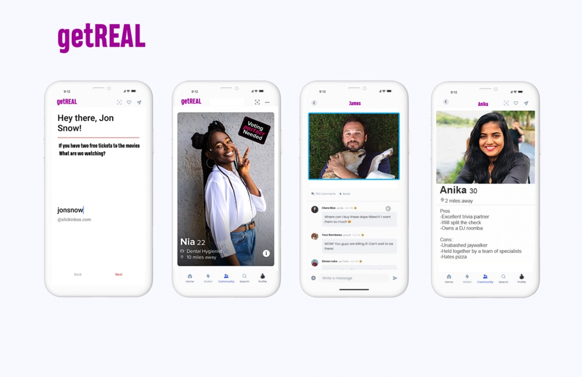

# getReal
GA Project 3

---

### Why another dating App?

Our team decided on a mobile first dating app with a difference. Too often what people communicate in the digital realm doesn't line up when you meet in meetspace. We believe the power of micropayments can better align the incentives for users seeking meaningful relationships.
We plan on incorporating the Stripe API for a payment system that will allow users to subscribe with recurring micropayments - allowing them to become members of the community. By creating this small paywall we hope to create a space that filters out inauthentic users who are simply flicking through users to find a hookup. 

Our group has plans to upgrade the app in the near future, things which will be added in the near future will be marked out @@@ like so @@@.

### Wireframes:

--- 

### Functionality:

This is a MERN Stack app with a simple Profile schema that references Passport's user schema. The intention behind this was so that when a user registers they are linked solely to their profile and can only edit/delete their own... This app has succeeded in achieving the MVP for this project - which was a full CRUD, single page MERN App. 

@@@ Chat functionality hasn't yet been implemented but is something that our group plans on adding in the near future. This will likely be done with the addition of Firebase as an additional db. 

Upon registration, a user is navigated immediately to our create-a-profile page where they add necessary details about themselves. After this, they have to clear one last hurdle prior to gaining access to the main site - that is... the questionnaire. Here they are asked a series of questions that are pushed into an empty state array, and upon completion the final submission button will push all these specific preferences and interests that shape who the user is/ how they enjoy spending their time to the database.

### What's a user to do whilst traversing getReal?

After the questionnaire the user is free to roam the site, this means they can begin interacting with other users either by matching @@@liking, commenting, or starting conversations through out inbuilt chat@@@. Once the user reaches their homefeed, our intention was to already mould other users they are seeing to suit their location, preferences, age, sexual orientation etc. Additionally, we would have liked to have our search component/search functionality also filtering through all of these data variables. Unfortanately, we only incorporated the search/ and filtered homefeed based on location for the time being, but this is something that will be updated soon. 

### What we are proud of...

Throughout the development of much of the first half of this app, the grouped worked together organising front/backend scaffolding/architecture as well as designing the schema/database. Doing this as a team of 3 meant that much of our initial work was code-alongs, discussing what was going on whilst writing the code. Although this wasn't ideal for a project with time constraints, it meant that all 3 of us are well across the entire functionality of the App and the flow of code right from registration to the depths of removing matches etc. We are all agreed upon the fact that this made for a great learning experience and a holistic understanding of how a single page MERN app works. 

### To-do list in the near future:

- Chat functionality/ Firebase
- Polish CSS/ UI further 
- Swipe left/right for matches.
- Make more use of personality data/ display it in a more dynamic way. 
- Stripe API/payment system.
- Also make CSS viable for desktops. 
- Logged in users can't see themselves on the homefeed/ once a match is found, the two matched users are also hidden from the homefeed.

